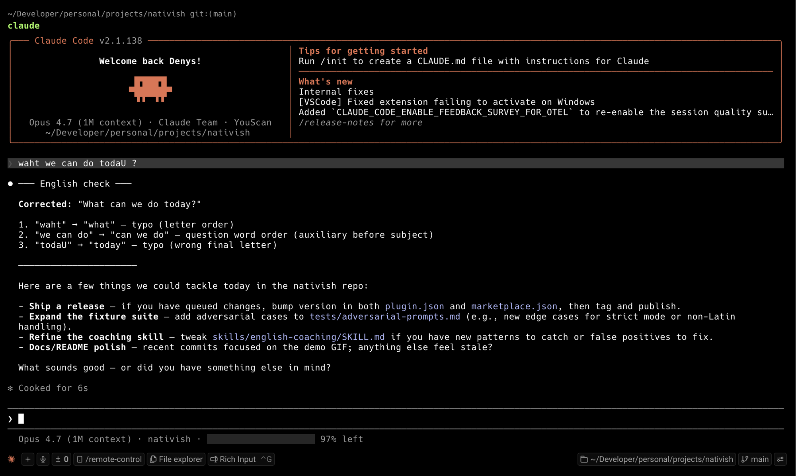

# Nativish

[](https://github.com/denys-petryniak/nativish/releases/latest)
[](LICENSE)
[](https://github.com/topics/claude-code-plugin)
[](https://github.com/denys-petryniak/nativish/stargazers)

A writing coach plugin for [Claude Code](https://www.anthropic.com/claude-code) — corrects your English before every response. Built for non-native speakers who code with Claude.



*Every message you send gets coached, inline, before the answer.*

## Install

```bash
/plugin marketplace add denys-petryniak/nativish
/plugin install nativish@nativish
```

Restart your Claude Code session for the `SessionStart` hook to take effect.

## What it does

Before every response, Claude inspects your prompt:

- Real grammar, spelling, or word-choice mistakes → a corrected version plus a numbered list of fixes
- Clean prompt → a one-line compliment
- Slash command, short ack (`yes`, `ok`, `thanks`), or message in a non-Latin script → silent

Toggle:

- `/nativish:off` — disable for the conversation
- `/nativish:on` — switch to default mode (chat-forgiving)
- `/nativish:strict` — switch to strict mode (also flags missing apostrophes, lowercase first letter, missing terminal periods, and common abbreviations)
- Inline aliases: `nativish:off` / `nativish:on` / `nativish:strict` (or with a space: `nativish off`, etc.) — handy if you'd rather type than autocomplete. The marker must be the entire message, so pasting a doc that mentions one of them won't accidentally switch states.

Status markers tell you which state the coach is in at a glance:

- `✓ en-coach` — default mode (active, chat-forgiving)
- `✓ en-coach (strict)` — strict mode (active, flags chat-style typos too)
- `⏸ en-coach (off)` — disabled

## How it works

Two hooks, with different jobs:

- **`SessionStart`** injects the English-coaching skill into the conversation's system context, so the rule applies on every user message — no manual skill invocation needed.
- **`UserPromptSubmit`** re-states the mode decision immediately before each response, where it can't be crowded out as context grows. It also settles Mode 3 skips itself: slash commands, short acks, toggle markers, and non-Latin script are all mechanically decidable, so a shell script decides them and the model is left with the judgment call it's actually needed for — Mode 1 (real mistakes) versus Mode 2 (clean).

**Why the second hook exists.** A rulebook injected once at the top of a conversation loses ground as the conversation grows. Measured across 24 real sessions (577 prompts), coaching appeared on 94% of prompts during turns 1–5 but only 57% past turn 40 — a monotonic decay, on Opus. The per-prompt directive costs about 60 tokens, roughly 0.06% of a session's output.

Dependencies degrade gracefully: without `jq` the hook is a silent no-op, and without `perl` only the script check is skipped, leaving that call to the model as before. The hook never blocks a prompt — on any error it prints nothing and exits 0.

## Privacy & security

Nativish is a self-contained Markdown + shell plugin:

- **No network calls** beyond the standard Anthropic API that Claude Code itself uses.
- **No telemetry**, no analytics, no external services.
- **No system file modifications** — the plugin only injects text into the conversation context via its two hooks.
- **No state written to disk** — mode (default/strict/off) lives in the conversation only.
- **Your prompts stay local.** The `UserPromptSubmit` hook reads each prompt to classify it, but that happens in a local shell script; nothing is written, logged, or sent anywhere.
- **No elevated permissions required** — does not request bypass-permissions mode or any permission overrides.

The full installation is a few Markdown files and two shell scripts. Inspect everything in [`hooks/`](hooks/) and [`skills/english-coaching/`](skills/english-coaching/).

## Known limitations

- **Model variance.** Mode 3 skips are decided by the `UserPromptSubmit` hook, so they no longer depend on the model. Everything else is still enforced via prose rules and varies: which fixes get raised, whether the Mode 1/2 split is judged well, and formatting slips like wrapping a Mode 3 marker in dividers. Expect a high-but-not-perfect pass rate on smaller models. The fixture suite at `tests/adversarial-prompts.md` catches regressions.
- **Pasted content gets coached too.** Code, logs, error messages, quoted prose — all of it is treated as text to check. Expect occasional false flags on snippets you didn't write.
- **Long prompts are truncated in `Corrected:`.** Only the first 2–3 sentences are echoed back; fixes for later sentences still appear in the numbered list below.

## Why "Nativish"?

A coined word — *almost native*. The plugin won't turn you into a native speaker, but it nudges your written English a little closer every conversation.

---

*Made with Claude, for Claude.* 🧡
